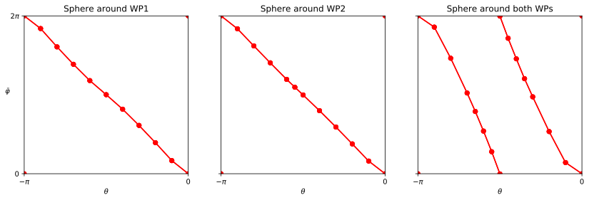

Chirality of a Weyl point (Quantum ESPRESSO)
============================================

In this example, the chirality of two Weyl points of MoP\ :sub:`2` is calculated from first-principles using Quantum ESPRESSO. The Chern number is calculated for three different spheres: The first two surrounding one Weyl point each, and the third containing both Weyl points. Since the two Weyl points have the same chirality (-1), the Chern number adds up to be -2 for the third sphere. The results are shown in the figure below.

This example uses the new interface to Wannier90 2.1 and QE 6. The input files can be found on the `github repository <https://github.com/Z2PackDev/Z2Pack/tree/master/2.1.x/examples/fp/MoP2_weyl_qe>`_.

.. include:: ../../../examples/fp/MoP2_weyl_qe/run.py
    :code: python
